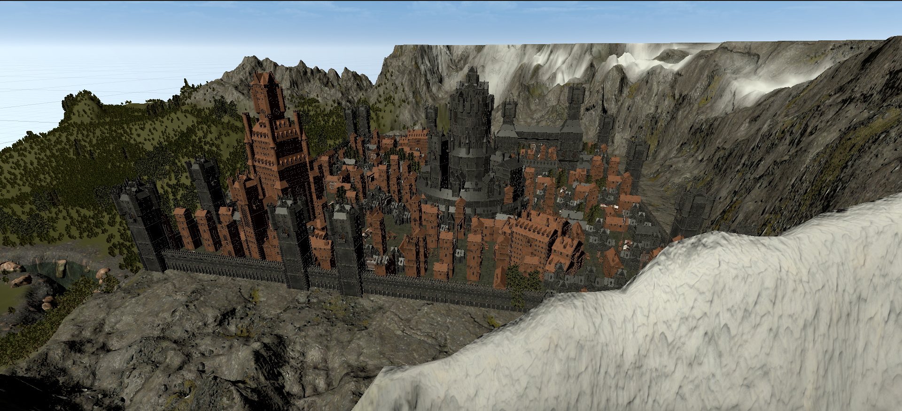

# Medieval City Generator

# Abstract
Inspired by the drawing of one of our members, we wanted to bring the scene she drew to 3D. With that purpose, we decided to procedurally generate a medieval force to get different versions of it! By different versions we mean not only different distribution of the buldings, but also different heigths for the houses, for instance.
Additionally, we also generated textures for the ground of the village by using wave function collapse randomly distributing the tiles.
Finally, we added extra objects to the environment to get an overall more convincing scene. This meant working on the modelling the terrain, materials and textures of the scene.

# Technical approach
The whole project was created using Unity (version 2021.3.21.f1), as the graphical part is more approachable and easier to look impressive. The castle is created in the environment from a starting point, from which the grid surface of the force is then generated.
The castle will be generated using the 3D variant of the Wave Function Collapse, which allow us to not only have different spatial distributions but altitudes for the buildings.

We used the Wave Function Collapse at two different levels :

- one, for placing the different buildings models in the city grid. We used the 3D variant of the Wave Function Collapse and make some adjustments to mitigate the different sizes of the models, and intra-compatibility of the different models as well as fine tuning the adjacency probabilities to obtain a realistic result.  We have based our implementation on the city generation project and made some adaptations to our needs :  
  This implementation now defines a 3D grid, in which for each iteration the cell with the lowest entropy is selected. One adaptation that we made is to proceed with the collapsing layer by layer (y-axis), as some tiles have a dependency with other tiles on a lower level, and also for animation purposes. 
  A tile is defined as a **Cell**, a class that contains the instantiated GameObject, the neighbouring cells, weights of prototypes and the different possibilities for this tile.  
  In this implementation, a possible tile is defined as a **Prototype** : a class that contains all the necessary informations for the proper instantiation of a tile as a GameObject in Unity, which are:
   - the prefab used
   - the meshRotation: n*90° y-axis rotation of the object
   - terminal : defines if another prototype can be on top of this prototype (y-axis wise), particularly useful as we defined some houses as 3 separate tiles (base, floor, roof)
   - randomRotation: during the instantiation, defines if the object can be rotated (y-axis)
   - parentLinked: defines if the current tile is related to its negative y-axis neighbour 
   - rotation: 3D rotation vector
   - translate: 3D translation vector
   - weight: raw probability of selecting this tile   
  
    A **Socket** defines the compatibility between the tiles : we modified it to make this relation asymmetric and avoid undesired commutativity.

  After generating the fixed size tiles, we place the core buildings of the city given their specified position, and clear the instantiated game objects on the tiles the buildings will be positionned. To do this, we define a bounding box for each building and collect the cells colliding this box, before iterating through them. To run this generator individually, in the Unity Editor Scene, you can select the castle_generator object and deselect the texture_generator then pass into Game Mode (the generation can take a little bit of time).

   (City generation: https://www.youtube.com/watch?v=rI_y2GAlQFM / https://github.com/TJGameDev/NeonRogue)

- the other, for generating the ground texture of our castle based adding more randomness and realism to the observed patterns on the ground :

  The texture generation is closer to the original Wave Function Collapse algorithm, as it analyses the input texture to automatically extract its features and patterns, and generate a seemingly but original texture. 
  Our implementation works by dividing the output texture into tiles, each with a specified size. It iterates over each tile and selects a compatible pattern from the input texture based on the neighboring tiles. We compare and check the compatibility of patterns by using the colors of neighbouring pixels. The compatibility checking between tiles ensures that the generated output maintains coherent and consistent patterns based on the input texture.  

  After generating the output texture, we create a material using the Universal Render Pipeline/Lit shader and assigns the output and normal output textures to the material, with a specified tiling scale. We save the generated texture to be able use it in the castle generator.  We define a list of previously generated textures, and assign for each row a random texture picked from this list based on the observation that the vertical bounds (z-axis) of the generated textures are contiguous.  
  To run this generator individually, in the Unity Editor Scene, you can deselect the castle_generator object and select the texture_generator then pass into Game Mode (the generation can take a little bit of time).

  (Texture generation : https://github.com/mxgmn/WaveFunctionCollapse)

# Results
**A medieval city/castle procedurally generated** 

  
  
<em>Perspective view</em>

  
  
<em>Upside view</em>

  
  
<em>City view (1)</em>

  
  
<em>City view (2)</em>

  
  
<em>City view (3)</em>

**Texture generation** 

  

    
  

  
<em>Original pavement texture (tiling 5x5)</em>

  

    
    
    
  

  
<em>Generated pavement texture (tiling 5x5)</em>

See more photos and videos of the procedural in the [photos](./photos)

# Contributions from each team member
- Finding castle kit, Unity setup, reading about the algorithms to use, visualizations: Ewa/Violeta/Nael
- Castle environment in Blender: Ewa
- Wave collapse function implementation: Ewa/Violeta/Nael
- Texture generation: Nael
- Report and presentation: Violeta

# Resources
**WFC concept**

https://scaleyourapp.com/procedural-generation-a-comprehensive-guide-in-simple-words/
https://www.youtube.com/watch?v=tyS7WKf_dtk
https://dev.to/kavinbharathi/the-fascinating-wave-function-collapse-algorithm-4nc3

**Procedural city generation**

https://www.youtube.com/watch?v=Jsc3BQaJndQ
https://github.com/TJGameDev/NeonRogue

**WFC implementation**

https://github.com/mxgmn/WaveFunctionCollapse

**Blender objects**
[Castle kit](https://rendercrate.com/objects/RenderCrate-Medieval_Castle_Kit)

[Sign](https://www.turbosquid.com/3d-models/medieval-signboard-model-1173470)

[Market](https://www.turbosquid.com/3d-models/medieval-market-asset-pack-3d-18060031)

[Boxes](https://www.turbosquid.com/3d-models/3d-medieval-boxes-1831631)
 
[SkyBox](https://assetstore.unity.com/packages/2d/textures-materials/sky/skybox-series-free-103633)

[Terrain](https://www.youtube.com/watch?v=MWQv2Bagwgk)
